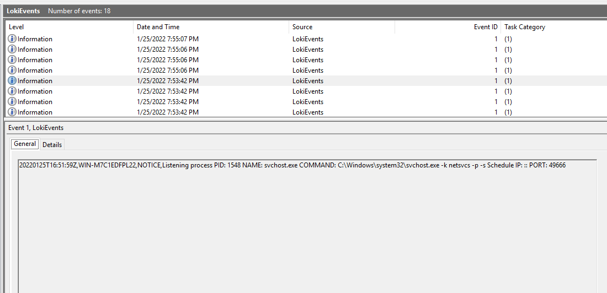
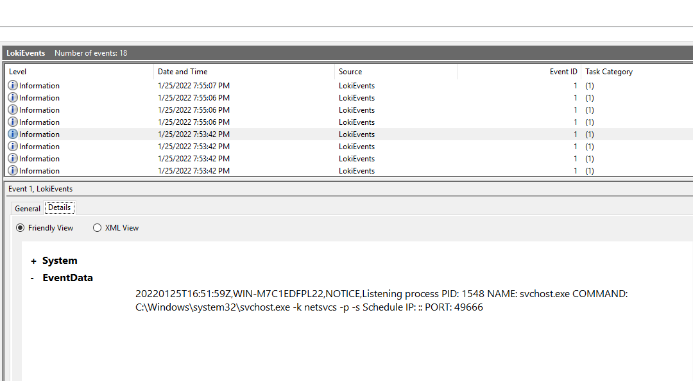

# LokiToWinEventLog

This repository containing script which allow [Loki](https://github.com/Neo23x0/Loki) to log to Windows Event Log so it can be collected for scaled up incident response.

## What is Loki?

From [author's webpage](https://github.com/Neo23x0/Loki):


## Installation Instructions

From an Admin Powershell console run ```.\Install.ps1```. 

## Script Activities:

This script does the following:

* Creates the directory structure at ```c:\Program Files\Loki2WindowsEventLog```.
* Write PowerShell code buffer to loki2wineventlog.ps1 in ```c:\Program Files\Loki2WindowsEventLog```.
* Downloads Loki Scanner from GitHub ```https://github.com/Neo23x0/Loki/releases/download/v0.44.2/loki_0.44.2.zip```.
* Sets up a scheduled task called ```LokiToWinEventLog``` to run the script every 3 hours and log to Windows Event Log called ```LokiEvents```.

## loki2wineventlog.ps1 Activities:

* Start Loki scanner using default rules.
* Log output to CSV file located in ```c:\Program Files\Loki2WindowsEventLog\logs```.
* Filter out INFO events and leave "NOTICE","ALERT","WARNING","RESULT" in for logging.
* Parse resulting CSV file into Windows Event Log called ```LokiEvents```.

## Output 




